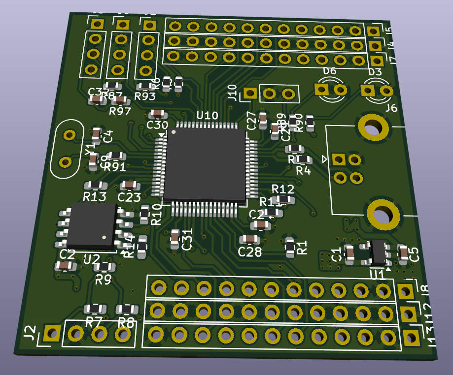
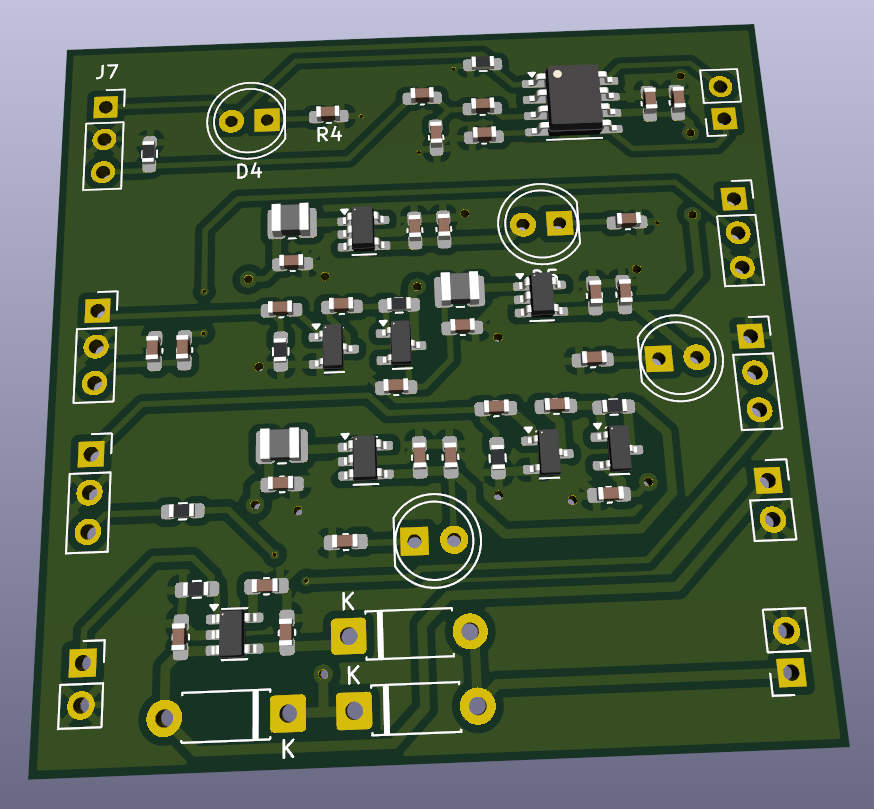
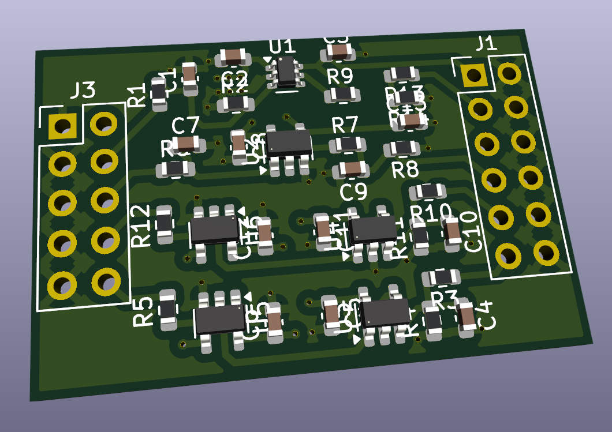
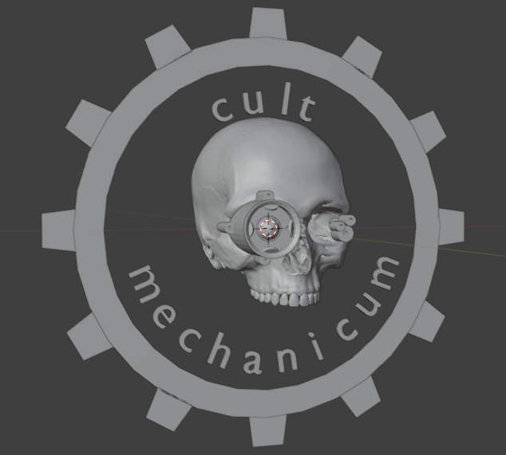
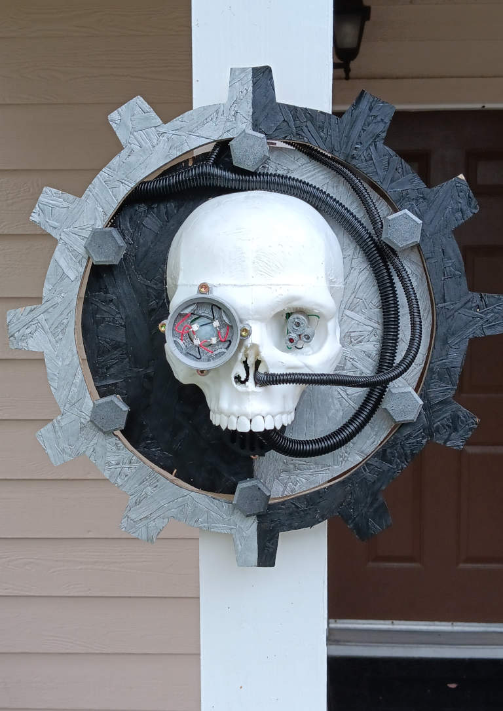

# Micropython Board
A convenient to work with implementation. It is not a minimalistic design, 
it has a full size USB-B socket, 16Mb of external SPI memory. The board is driven by STM32 microcontroller STM32F405RGT6.

All min arrays have extensive ground shielding and even neighbor pins have minimal crosstalk.

The layout is designed closely following the rules made by the Omnissiah himself (aka Hans Rosenberg) shared in his correct PCB layout tutorial videos.

# Audio Board
This is an extension for the micropython board. This audio board has a D-class on-chip power amplifier with analog input.

It has a step up 5V switching converter to ensure the audio driver is at 5V.

Also, it has a motion detector (PYR sensor) redinc circuit.

Lastly, it has a single driver circuit for an analog servo motor.

The intended usage of the board in Helloween props. The micropython board can be extended with this audio board to produce speech, detect when people approach, perform physical movements.

# Override Board
This board provides several analog and digital isolated IO channels. The intended use is to override analog turning axes in the Dial Sense Playstation 5 controller and force it to use external intertial aiming signal so that instead of being a torture device, it makes the Dual Sense to be pleasant to use.

# Servo Scull prop
A talking scull themed as Warhammer 40k Servo Scull by Adeptus Mechanicus. 

